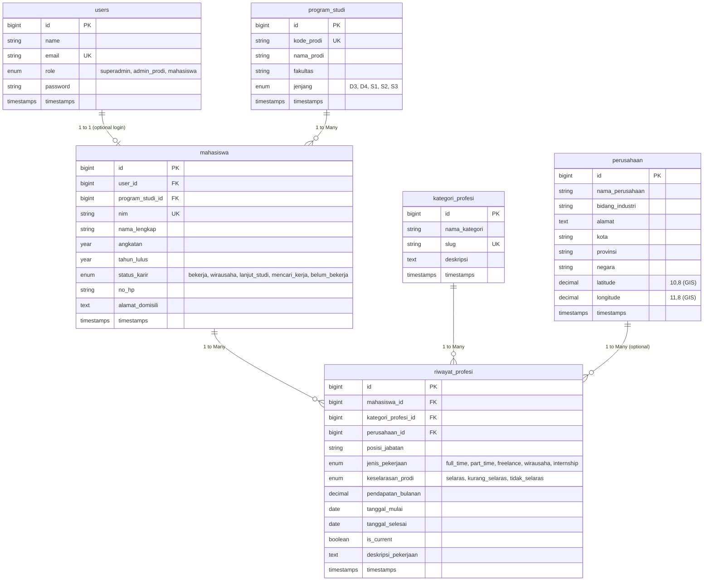

# 🗄️ Dokumentasi Perancangan Database (Week 1)

Dokumen ini menjelaskan struktur data, tabel, relasi (ERD), dan tipe data untuk **Aplikasi Pemetaan Mahasiswa Berdasarkan Profesi**.

---

## 📊 Diagram Relasi Tabel (Entity Relationship Diagram)

---

## 📑 Rincian Struktur Tabel

### 1. Tabel `users`
Mengelola autentikasi dan peran pengguna (*role-based access control*).
- `id` (BigInt, Primary Key)
- `name` (String)
- `email` (String, Unique)
- `role` (Enum: `superadmin`, `admin_prodi`, `mahasiswa`)
- `password` (String)

### 2. Tabel `program_studi`
Master data program studi / jurusan di perguruan tinggi.
- `id` (BigInt, Primary Key)
- `kode_prodi` (String 20, Unique) — Contoh: `IF`, `SI`, `MJ`
- `nama_prodi` (String) — Contoh: `Teknik Informatika`
- `fakultas` (String) — Contoh: `Fakultas Ilmu Komputer`
- `jenjang` (Enum: `D3`, `D4`, `S1`, `S2`, `S3`)

### 3. Tabel `kategori_profesi`
Master taksonomi pengelompokan jenis pekerjaan / profesi.
- `id` (BigInt, Primary Key)
- `nama_kategori` (String) — Contoh: `Software Engineering & Development`
- `slug` (String, Unique) — Contoh: `software-engineering`
- `deskripsi` (Text, Nullable)

### 4. Tabel `perusahaan`
Data perusahaan/tempat kerja alumni yang dilengkapi titik koordinat GIS.
- `id` (BigInt, Primary Key)
- `nama_perusahaan` (String) — Contoh: `PT Tokopedia`
- `bidang_industri` (String) — Contoh: `E-Commerce & Tech`
- `alamat` (Text, Nullable)
- `kota` (String)
- `provinsi` (String)
- `negara` (String, Default: `Indonesia`)
- `latitude` (Decimal 10,8) — Untuk Pemetaan Peta GIS Leaflet/Google Maps
- `longitude` (Decimal 11,8) — Untuk Pemetaan Peta GIS Leaflet/Google Maps

### 5. Tabel `mahasiswa`
Data profil utama mahasiswa / alumni.
- `id` (BigInt, Primary Key)
- `user_id` (BigInt, Foreign Key ke `users.id`, Nullable)
- `program_studi_id` (BigInt, Foreign Key ke `program_studi.id`)
- `nim` (String 30, Unique)
- `nama_lengkap` (String)
- `angkatan` (Year)
- `tahun_lulus` (Year, Nullable)
- `status_karir` (Enum: `bekerja`, `wirausaha`, `lanjut_studi`, `mencari_kerja`, `belum_bekerja`)
- `no_hp` (String 20, Nullable)

### 6. Tabel `riwayat_profesi`
Data pencatatan karir, posisi, gaji, dan analisis keselarasan prodi.
- `id` (BigInt, Primary Key)
- `mahasiswa_id` (BigInt, Foreign Key ke `mahasiswa.id`)
- `kategori_profesi_id` (BigInt, Foreign Key ke `kategori_profesi.id`)
- `perusahaan_id` (BigInt, Foreign Key ke `perusahaan.id`, Nullable)
- `posisi_jabatan` (String) — Contoh: `Junior Fullstack Web Engineer`
- `jenis_pekerjaan` (Enum: `full_time`, `part_time`, `freelance`, `wirausaha`, `internship`)
- `keselarasan_prodi` (Enum: `selaras`, `kurang_selaras`, `tidak_selaras`) — Untuk Analisis Linearitas Karir
- `pendapatan_bulanan` (Decimal 12,2, Nullable)
- `tanggal_mulai` (Date, Nullable)
- `is_current` (Boolean, Default: `true`)
