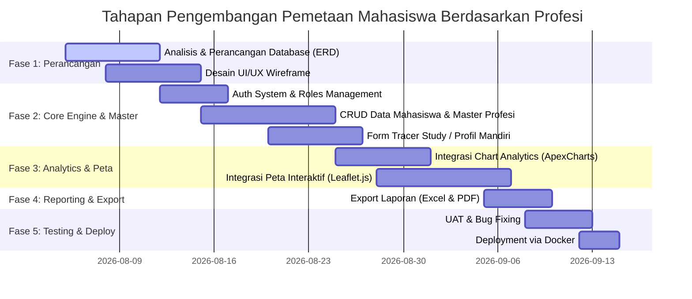

# 🗺️ Roadmap Development: Aplikasi Pemetaan Mahasiswa Berdasarkan Profesi

Dokumen ini berisi panduan alur pengembangan (*roadmap*) pembuatan **Aplikasi Pemetaan Mahasiswa & Alumni Berdasarkan Profesi**, keselarasan karir, dan sebaran lokasi kerja.

---

## 🎯 Tujuan Utama Sistem
1. **Memetakan Distribusi Profesi**: Mengelompokkan mahasiswa dan alumni berdasarkan bidang pekerjaan/profesi, industri, dan jenjang karir.
2. **Mengukur Keselarasan Karir**: Menganalisis tingkat kesesuaian (*alignment rate*) antara program studi/jurusan dengan bidang pekerjaan yang ditekuni.
3. **Visualisasi Sebaran Geografis**: Menampilkan peta interaktif distribusi lokasi kerja mahasiswa/alumni di tingkat daerah, nasional, maupun internasional.
4. **Mendukung Tracer Study & Akreditasi**: Menyediakan laporan statistik otomatis untuk kebutuhan akreditasi kampus (BAN-PT / LAM).

---

## 👥 Pengguna & Hak Akses (Multi-Role)
- 🔴 **Super Admin / Pengelola Pusat**: Akses penuh ke seluruh fitur, manajemen user, dan konfigurasi master data.
- 🟡 **Admin Prodi / Fakultas**: Mengelola data mahasiswa prodi tertentu, melihat analytics & laporan per prodi.
- 🔵 **Mahasiswa / Alumni**: Mengisi & memperbarui data profil mandiri, riwayat profesi, dan tempat bekerja.

---

## 🗓️ Tahapan Pengembangan (Phase-by-Phase Roadmap)

---

### 🔹 Fase 1: Perancangan Structure & Database (Minggu 1)
- [ ] **Skema Tabel Database**:
  - `users`: Account login & role.
  - `mahasiswa`: NIM, Nama, Prodi, Angkatan, Tahun Lulus, Status (Bekerja, Wirausaha, Lanjut Studi, Belum Bekerja).
  - `kategori_profesi`: Master bidang (Software Engineering, Data & AI, Finance, Education, UI/UX, dll).
  - `riwayat_profesi`: Judul Jabatan, Nama Perusahaan, Kategori Profesi, Gaji (Opsional), Lokasi (Kota/Provinsi/Negara), Tanggal Mulai.
  - `wilayah`: Master koordinat & nama daerah untuk pemetaan GIS.
- [ ] **Wireframing UI/UX**: Desain tampilan Dashboard Utama, Form Profil, & Peta Sebaran.

---

### 🔹 Fase 2: Core Engine & Management Data (Minggu 2 - 3)
- [ ] **Sistem Autentikasi & Otorisasi**:
  - Login/Register Mahasiswa (Integrasi NIM/SSO jika ada).
  - Middleware role-based accesscontrol (`admin`, `prodi`, `mahasiswa`).
- [ ] **Manajemen Master Data (Admin)**:
  - CRUD Master Kategori Profesi & Industri.
  - Import Data Mahasiswa/Alumni via Excel (`maatwebsite/excel`).
- [ ] **Portal Profil Mandiri (Mahasiswa/Alumni)**:
  - Form pengisian data pekerjaan saat ini & riwayat karir.
  - Input lokasi perusahaan dengan Autocomplete / Pinpoint Google Maps / Leaflet.

---

### 🔹 Fase 3: Visualisasi Analytics & Peta GIS (Minggu 4 - 5)
- [ ] **Interactive Geo-Mapping (Peta Sebaran Profesi)**:
  - Integrasi peta interaktif menggunakan **Leaflet.js** atau **Mapbox**.
  - Heatmap & Cluster Marker berdasarkan kepadatan lokasi alumni bekerja.
  - Pop-up rinci: Menampilkan daftar alumni di titik lokasi tersebut.
- [ ] **Dashboard Statistical Analytics**:
  - Pie Chart: Persentase Mahasiswa Bekerja vs Wirausaha vs Lanjut Studi.
  - Bar Chart: 10 Profesi Terbanyak yang Ditekuni.
  - Gauge Chart / Indicator: Persentase Keselarasan Karir (Linearitas Prodi dengan Pekerjaan).
- [ ] **Sistem Filter Dinamis**:
  - Filter grafik & peta berdasarkan **Program Studi**, **Angkatan**, **Kategori Profesi**, dan **Wilayah**.

---

### 🔹 Fase 4: Reporting, Export & Verifikasi (Minggu 6)
- [ ] **Verifikasi Data oleh Admin Prodi**:
  - Fitur menyetujui / memverifikasi pembaruan data profesi dari alumni.
- [ ] **Export Laporan Otomatis**:
  - Export rekapitulasi data profesi ke format **Excel (.xlsx)**.
  - Generate Laporan Ringkasan PDF untuk Borang Akreditasi BAN-PT/LAM.

---

### 🔹 Fase 5: Testing, Hardening & Deployment (Minggu 7)
- [ ] **Testing & Quality Assurance**:
  - Unit Testing & Feature Testing (`php artisan test`).
  - UAT (User Acceptance Testing) bersama pihak Prodi/Kampus.
- [ ] **Deployment via Docker**:
  - Deploy ke Server Staging / Production menggunakan `docker compose`.
  - Konfigurasi SSL Certificate & Reverse Proxy Nginx.

---

## 🛠️ Stack Teknologi Terpilih
- **Backend Framework**: Laravel 13 (PHP 8.4)
- **Database**: MySQL 8.0
- **Frontend / Styling**: Blade / Vue.js / Inertia.js + Tailwind CSS
- **Peta Interaktif**: Leaflet.js (OpenStreetMap) / Mapbox API
- **Chart Library**: ApexCharts.js / Chart.js
- **Container**: Docker & Docker Compose
