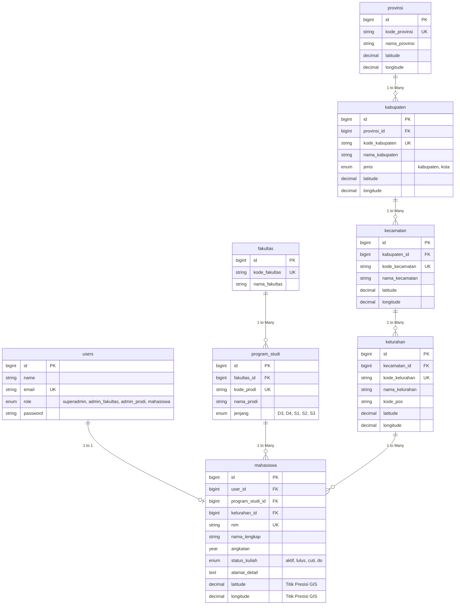
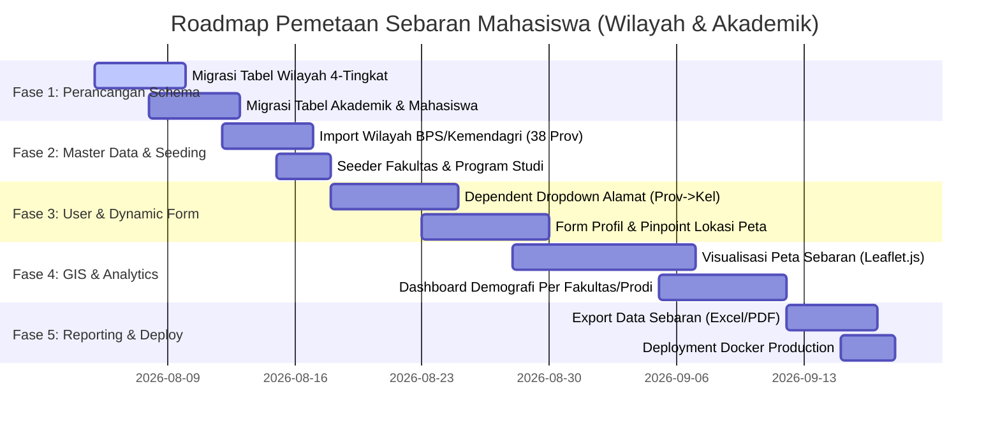

# 🗺️ Roadmap Development: Aplikasi Pemetaan Sebaran Mahasiswa Berdasarkan Wilayah & Akademik

Dokumen ini berisi panduan alur pengembangan (*roadmap*) spesifik untuk **Aplikasi Pemetaan Sebaran Geografis Mahasiswa** berdasarkan hirarki **Wilayah Administratif Indonesia** (`Provinsi` ➔ `Kabupaten/Kota` ➔ `Kecamatan` ➔ `Kelurahan/Desa`) dan **Struktur Akademik Kampus** (`Fakultas` ➔ `Program Studi`).

---

## 🎯 Tujuan Utama Sistem
1. **Pemetaan Sebaran Bertingkat**: Menampilkan sebaran tempat tinggal / asal mahasiswa dari tingkat Provinsi hingga Kelurahan/Desa secara akurat.
2. **Visualisasi GIS Interaktif**: Menampilkan peta wilayah dengan marker clustering, choropleth map, dan statistik per daerah.
3. **Analisis Demografi Akademik**: Menganalisis daerah penyumbang mahasiswa terbanyak per Fakultas & Program Studi untuk keperluan strategi promosi penerimaan mahasiswa baru (PMB).
4. **Hierarki Data Lengkap**: Mengintegrasikan 8 entitas utama: `users`, `fakultas`, `program_studi`, `provinsi`, `kabupaten`, `kecamatan`, `kelurahan`, dan `mahasiswa`.

---

## 🗄️ Entitas & Relasi Data Utama (8 Tabel Utama)

---

## 🗓️ Tahapan Pengembangan (Phase-by-Phase Roadmap)

---

### 🔹 Fase 1: Perancangan Basis Data (Database Design)
- [ ] **Struktur Master Akademik**:
  - `fakultas`: Mengelompokkan program studi di bawah fakultas tertentu.
  - `program_studi`: Relasi `fakultas_id`, kode prodi, nama prodi, dan jenjang.
- [ ] **Struktur Hirarki Wilayah Indonesia**:
  - `provinsi`: Kode ISO/Kemendagri, Nama Provinsi, Pusat Koordinat GIS.
  - `kabupaten`: Relasi `provinsi_id`, Kode Kabupaten/Kota, Jenis (Kabupaten / Kota).
  - `kecamatan`: Relasi `kabupaten_id`, Kode Kecamatan.
  - `kelurahan`: Relasi `kecamatan_id`, Kode Kelurahan, Kode Pos.
- [ ] **Struktur Mahasiswa & Users**:
  - `users`: Role (`superadmin`, `admin_fakultas`, `admin_prodi`, `mahasiswa`).
  - `mahasiswa`: Memiliki Foreign Key `program_studi_id` dan `kelurahan_id` serta titik koordinat presisi (`latitude`, `longitude`).

---

### 🔹 Fase 2: Impor Data Master & Seeding
- [ ] **Data Wilayah Wilayah Indonesia (Kemendagri / BPS)**:
  - Mengimpor 38 Provinsi, ~514 Kabupaten/Kota, ~7.200 Kecamatan, dan ~83.000 Kelurahan/Desa.
- [ ] **Data Fakultas & Program Studi**:
  - Menyediakan seeder Fakultas (Teknik, Ilmu Komputer, Ekonomi, dll.) dan Program Studi (Teknik Informatika, Sistem Informasi, Manajemen, dll.).

---

### 🔹 Fase 3: Portal Input Data Mandiri & Dependent Dropdown
- [ ] **Form Input Alamat Berjenjang (*Dependent Dropdown*)**:
  - Fitur AJAX / API saat pilih **Provinsi** ➔ otomatis memuat **Kabupaten/Kota** ➔ memuat **Kecamatan** ➔ memuat **Kelurahan**.
- [ ] **Fitur Pinpoint Lokasi Tempat Tinggal**:
  - Peta kecil di form profil untuk mahasiswa menandai titik lokasi persis tempat tinggal (*Drag & Drop Marker*).

---

### 🔹 Fase 4: GIS Mapping & Analytics Dashboard
- [ ] **Peta Sebaran Mahasiswa (Interactive GIS Map)**:
  - Gunakan **Leaflet.js** / OpenStreetMap dengan **Marker Cluster**.
  - **Filter Interaktif Multi-Dimensi**:
    - Filter berdasarkan **Fakultas** / **Program Studi**.
    - Filter berdasarkan **Angkatan** & **Status Kuliah** (Aktif/Lulus).
    - Zoom-to-Region: Klik Provinsi/Kabupaten otomatis memperbesar peta ke wilayah tersebut.
- [ ] **Dashboard Statistik Demografi**:
  - **Bar Chart**: 10 Kabupaten/Kota penyumbang mahasiswa terbanyak.
  - **Pie Chart**: Persentase Sebaran Mahasiswa per Fakultas.
  - **Tabel Rekapitulasi**: Jumlah mahasiswa per Provinsi & Kabupaten.

---

### 🔹 Fase 5: Pelaporan, Export & Deployment
- [ ] **Export Data Sebaran**:
  - Export rekapitulasi sebaran ke Excel (`.xlsx`) per Fakultas / Per Wilayah.
  - Cetak Ringkasan Laporan Peta ke PDF.
- [ ] **Deployment Docker Container**:
  - Deploy seluruh aplikasi menggunakan Docker & Nginx.
